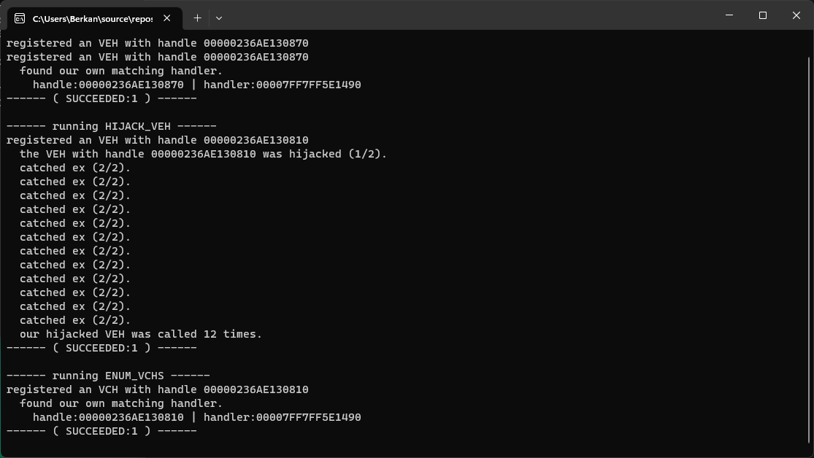

# WARNING
This seems to break on later windows 11 versions, meaning it's not really portable across different windows builds. This makes it pretty limited in usability, unless you can come up with a way to improve the dynamic lookup and hardcode any edge cases!  

# Intro
I wanted to create a demo project which interacts with vectored handlers on windows, and this is the outcome.  
It currently implements enumerating and hijacking VHs. However, adding one is still on my todo! It was simply not a priority due to the background of why this was written.  

# Use Case Samples
- Enumerating all registered VHs in a process and run checks on them, for example if they reside in a valid module.
- Hijacking already present VHs to execute your own logic instead.
- Removing a VH by calling `RemoveVectoredExceptionHandler` on it's handle (TODO: implement removing them without API.)

# Notes
For a seamless experience without having to step through all exceptions manually, run the demo without having a debugger attached. This is how the unchanged demo output will look like:  

# References
https://dimitrifourny.github.io/2020/06/11/dumping-veh-win10.html
